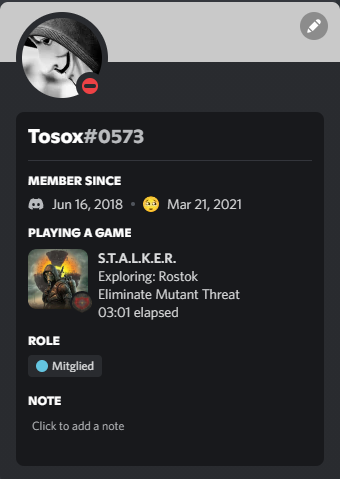

# rpc4stalker
[](https://en.wikipedia.org/wiki/C%2B%2B) 
[](https://store.steampowered.com/app/41700/STALKER_Call_of_Pripyat) 
[](https://github.com/Tosox/rpc4stalker)
[](https://github.com/Tosox/rpc4stalker)
[](https://github.com/Tosox/rpc4stalker/releases)

> Note: *This mod is only compatible with games based on [Call of Chernobyl](https://www.moddb.com/mods/call-of-chernobyl)*

```
                               $$\   $$\             $$\               $$\ $$\                           
                               $$ |  $$ |            $$ |              $$ |$$ |                          
  $$$$$$\   $$$$$$\   $$$$$$$\ $$ |  $$ | $$$$$$$\ $$$$$$\    $$$$$$\  $$ |$$ |  $$\  $$$$$$\   $$$$$$\  
 $$  __$$\ $$  __$$\ $$  _____|$$$$$$$$ |$$  _____|\_$$  _|   \____$$\ $$ |$$ | $$  |$$  __$$\ $$  __$$\ 
 $$ |  \__|$$ /  $$ |$$ /      \_____$$ |\$$$$$$\    $$ |     $$$$$$$ |$$ |$$$$$$  / $$$$$$$$ |$$ |  \__|
 $$ |      $$ |  $$ |$$ |            $$ | \____$$\   $$ |$$\ $$  __$$ |$$ |$$  _$$<  $$   ____|$$ |      
 $$ |      $$$$$$$  |\$$$$$$$\       $$ |$$$$$$$  |  \$$$$  |\$$$$$$$ |$$ |$$ | \$$\ \$$$$$$$\ $$ |      
 \__|      $$  ____/  \_______|      \__|\_______/    \____/  \_______|\__|\__|  \__| \_______|\__|      
           $$ |                                                                                          
           $$ |                                                                                          
           \__|                                                                                           
```

## Installation
- Download the latest [release](https://github.com/TosoxDev/rpc4stalker/releases)
- Install the VC Redistributables located in the `redist` folder if necessary
- Install the `gamedata` folder like any other mod
- Copy the contents of the `win32` folder into the [Data Install Location](#Compatability) (usually the `bin` folder) if the game's platform is x32
- Copy the contents of the `win64` folder into the [Data Install Location](#Compatability) (usually the `bin` folder) if the game's platform is x64
    * You can check the platform of some tested games [here](#Compatability)
- If everything was installed correctly, a console window should appear when the game is started
- Open the game and load a save to update the rich presence data

## Compilation
- `C++ 17` is required for compilation

## Preview



## FAQ
### Which S.T.A.L.K.E.R. games is the program compatible with?
It is compatible with all games *based* on the [Call of Chernobyl](https://www.moddb.com/mods/call-of-chernobyl) mod. Unfortunately, this does not include the three original games. A list of tested games can be found [here](#Compatability).

### How does the program work?
The mod that needs to be installed is the most important part of this program. It saves the data to be displayed in the discord status in a file in `%temp%\rpc4stalker.json`. The dll is only responsible for reading and transmitting the data to discord via their [GameSDK](https://discord.com/developers/docs/game-sdk/sdk-starter-guide).

### Can the mod conflict with other mods?
No, because no files need to be overwritten during the installation.

## Compatability
| Game                                  | Platform  | Data Install Location     |
|---------------------------------------|-----------|---------------------------|
| S.T.A.L.K.E.R. Call of Chernobyl      | Win32     | /bin/                     |
| S.T.A.L.K.E.R. Call of The Zone       | Win32     | /bin/                     |
| S.T.A.L.K.E.R. Call of Misery         | Win32     | /bin/                     |
| S.T.A.L.K.E.R. Road To The North      | Win64     | /bin/                     |
| S.T.A.L.K.E.R. Global War             | Win32     | /bin/                     |
| S.T.A.L.K.E.R. Anomaly                | Win64     | /bin/                     |
| S.T.A.L.K.E.R. Dead Air               | Win32     | /                         |
| S.T.A.L.K.E.R. A.R.E.A.               | Win32     | /bin/                     |

## Credits
- [ThirteenAG](https://github.com/ThirteenAG) for his [ASI-Loader](https://github.com/ThirteenAG/Ultimate-ASI-Loader)
- [Discord](https://github.com/discord) for their [GameSDK](https://discord.com/developers/docs/game-sdk/sdk-starter-guide)
- [GNU](https://www.gnu.org) for their conversion library [libiconv](https://www.gnu.org/software/libiconv)
- [nlohmann](https://github.com/nlohmann) for a modern C++ [implementation of JSON](https://github.com/nlohmann/json)

